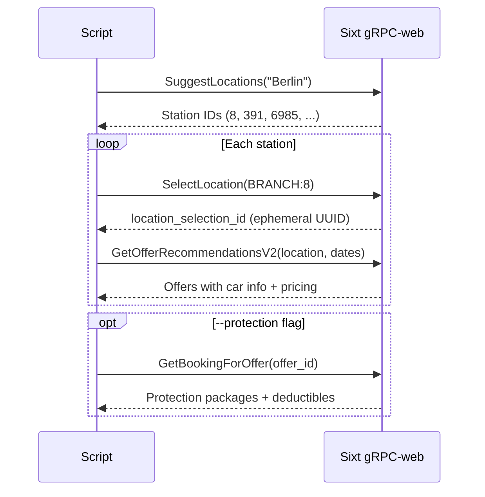

# sixt-rental

TypeScript + Bun project powering the [`sixt-rental`](../../SKILL.md) agent skill. Talks to Sixt's unauthenticated gRPC-web API to search rental offers, compare prices across stations, and generate booking URLs.

## API flow

Every search follows this sequence against `grpc-prod.orange.sixt.com`:



The `--protection` step is the expensive one — each call is a separate API round-trip. The search script sorts by base price first, then fetches protection only for the top `--limit` offers (default: 5) to avoid the N+1 problem.

## Quick start

```bash
bun install
bun run search -- --pickup "2026-04-01T10:00" --return "2026-04-03T18:00" --city Berlin
```

All three scripts output **JSON to stdout** by default (for agent consumption) and accept `--table` for human-readable output. Diagnostics go to stderr.

```bash
bun run search      # sixt-search.ts — offers across stations
bun run stations    # sixt-stations.ts — station ID lookup
bun run booking-url # sixt-booking-url.ts — direct Sixt booking URL
```

Pass `--help` to any script for full usage.

## Project structure

```
bin/          Entry points (shebanged, runnable with bun)
lib/          Shared library modules
test/         Unit tests (bun test)
build.sh      Compile to standalone binaries (bun build --compile)
```

### `lib/`

| Module | What it does |
|--------|-------------|
| `client.ts` | `fetch`-based gRPC-web client. Typed wrappers for all four API endpoints + `findProtection()` extractor. |
| `cli.ts` | `util.parseArgs()` with per-command option schemas, typed value interfaces, and validators (ISO datetime, date order, country code). |
| `format.ts` | Fixed-width ASCII table using `Bun.stringWidth()` for correct column alignment. ASCII flags (`EV`, `HYB`, `[G]`, `MAN`) replace emoji. |
| `countries.ts` | Country code → `{ pointOfSale, currency, domain, locale }`. Falls back to DE with a stderr warning. |
| `types.ts` | All shared interfaces: `SixtOffer`, `SixtStation`, `SixtProtection`, `CountryConfig`, etc. |

### `bin/`

| Script | Purpose |
|--------|---------|
| `sixt-search.ts` | Multi-station search with filters (`--electric`, `--family`), campaign codes, and optional protection pricing. |
| `sixt-stations.ts` | Station ID lookup by city name. Useful for discovering IDs before a targeted search. |
| `sixt-booking-url.ts` | Generates a pre-filled Sixt offer list URL with station, dates, and campaign baked in. |

## Development

```bash
bun test            # 39 tests across 4 files
bun run typecheck   # tsc --noEmit
```

Tests cover the pure-logic modules (`cli`, `client.findProtection`, `countries`, `format`) without hitting the API. The validators call `process.exit(1)` on failure — tests spy on it to assert error behavior.

<details>
<summary><strong>Adding a country</strong></summary>

Add an entry to the `countries` map in `lib/countries.ts`:

```typescript
XX: { code: "XX", pointOfSale: "XX", currency: "EUR", domain: "sixt.xx", locale: "xx-XX" },
```

This propagates everywhere — API params, currency formatting, and booking URL domain.

</details>

<details>
<summary><strong>Compiling standalone binaries</strong></summary>

```bash
./build.sh
```

Produces native executables in `bin/` (~50MB each, embeds Bun runtime). The shell wrappers in `../` can be updated to use these instead of `bun run`.

</details>

## How it fits into the skill

```
sixt-rental/
├── SKILL.md              ← Agent-facing skill definition
├── references/           ← On-demand docs (API, pricing, station IDs)
└── scripts/
    ├── sixt-search       ← Shell wrappers (stable interface)
    ├── sixt-booking-url
    ├── sixt-stations
    └── src/              ← You are here (the TS project)
```

The shell wrappers in `scripts/` are the skill's public interface — they `exec bun src/bin/<name>.ts "$@"`. SKILL.md references those wrappers. This decouples the skill's contract from the project's internal layout, so refactoring here doesn't break the skill.
